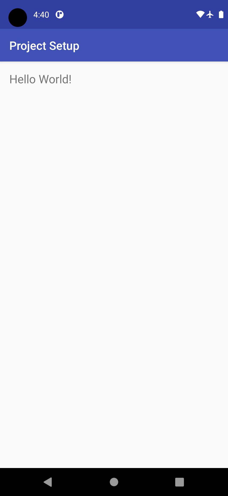
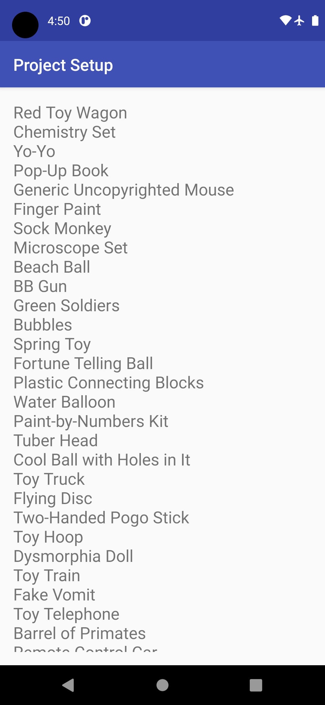
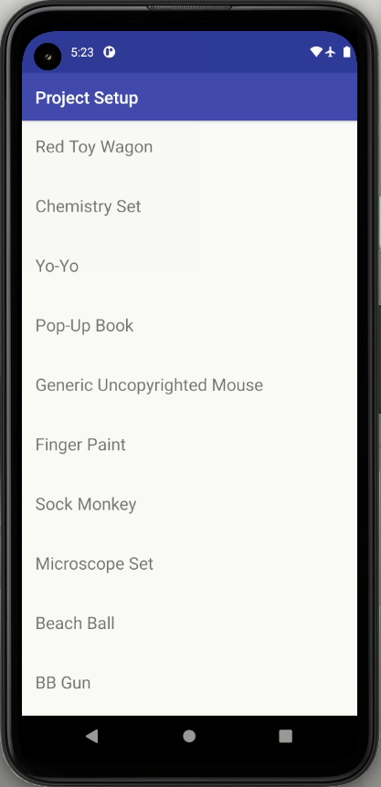
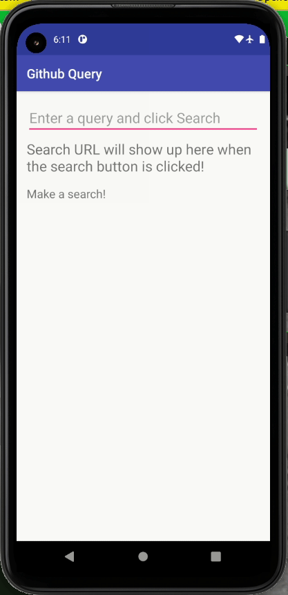
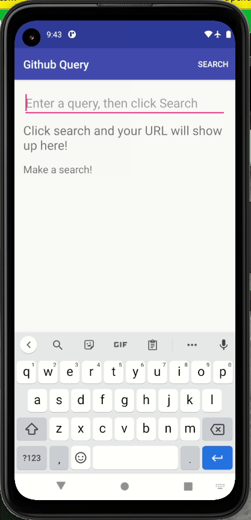

# Android app results

> Version of Android Studio used: 4.2 

## First Toy app - Favorite Toys

### 1. Create Layout

    
    
Figure 1. Layout creation

### 2. Display ToyList

    
    
Figure 2. Displaying a list

### 3. Add Scrolling

    
    
Figure 3. Creating ScrollView

## Second Toy app - Github Repo Search

### 1. Create Layout

    
    
Figure 4. Layout creation

### 2. Add Menu

    
    
Figure 5. Creation of Menu Item 'Search'

### 3. Display Url

### 4. Connecting to the Internet

### 5. Creating Async Task

### 6. Add Polish