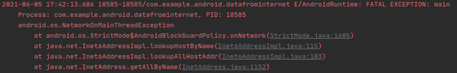
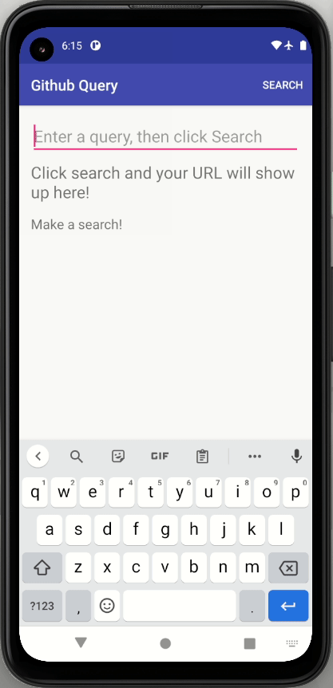
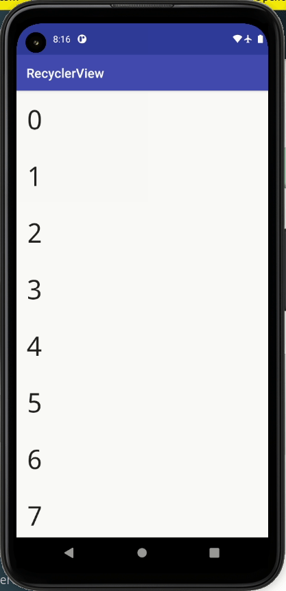

# Android app results

> Version of Android Studio used: 4.2 

## #1 Toy app - Favorite Toys

### 1. Create Layout

    
    
Figure 1. Layout creation

### 2. Display ToyList

    
    
Figure 2. Displaying a list

### 3. Add Scrolling

    
    
Figure 3. Creating ScrollView

## #2 Toy app - Github Repo Search

### 1. Create Layout

    
    
Figure 4. Layout creation

### 2. Add Menu

    
    
Figure 5. Creation of Menu Item 'Search'

### 3. Display Url

    
    
Figure 6. 

### 4. Connecting to the Internet

    
    
Figure 7. 

### 5. Creating Async Task

    
    
Figure 8. 

### 6. Add Polish

    
    
Figure 9. 

## #3 Toy app - Green Recycler View

### 1. RecyclerView Layout creation

### 2. ViewHolder

    
    
Figure 10. Displaying numbers on ViewHolder 

### 3. RecyclerView Adapter

### 4. Wiring up RecyclerView

### 5. Going Green

### 6. Refresh Menu Button

### 7. RecyclerView Click Handling

## #4 Toy App - Start New Activity

### 1. Add New Activity

### 2. Start New Activity

### 3. Passing Data Between Activities
